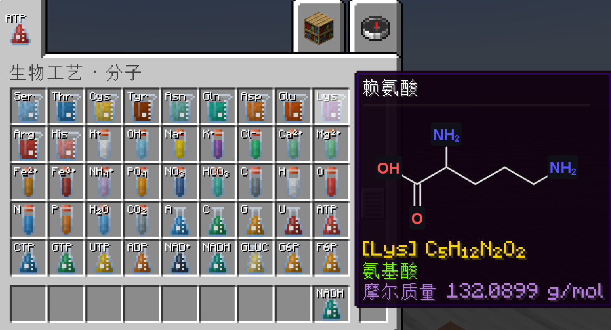

# BioCraft · 生物工艺

> 硬核生物化学科技模组 | Minecraft 1.21.1 / NeoForge | 将真实的代谢通路、中心法则、酶动力学完整搬进 Minecraft

## 创意与设想

### 设计理念：科学性是基石，游戏性是纽带

本模组的第一准则是尽可能忠实于生物化学与分子生物学的真实原理。游戏性是连接玩家与科学的桥梁，但桥梁不能扭曲基石的形状。

**你操作的将不再是"粉"与"锭"，而是分子。**

堆叠数 = 分子个数：1 个葡萄糖分子（C₆H₁₂O₆）就是 6 个碳原子 + 12 个氢原子 + 6 个氧原子，严格化学计量。玩家的仓库，就是一台活的分子计数器。

### 这个模组不是什么

- ❌ 不是"套皮科技模组"——不是把熔炉逻辑用生化名词重写一遍
- ❌ 没有 FE / Forge Energy 驱动的机器——能量是 ATP 分子，是**物品物流**，不是电线
- ❌ 没有原版风格的机器合成配方——**所有功能机器本质上都是蛋白质**，只能通过中心法则合成
- ❌ 没有 MK2/MK3 升级阶级、没有物理多方块结构——升级靠"酶插件"，细胞器靠相邻检测

### 核心玩法闭环

> TNT 爆炸等暴力化学手段获取基础原子/分子 → 搭建 DNA 编码器输入基因序列 → 经转录/翻译/折叠产出成熟酶蛋白 → 手持右键地面放置为功能性机器 → 搭建代谢流水线（糖酵解/TCA/ETC）产出更多 ATP → 用 ATP 驱动更复杂的合成与升级 → 最终实现物质与能量的自循环

### 三大体系

| 体系 | 内容 |
|---|---|
| **能量体系** | ATP 是唯一"通用货币"。机器每 tick 消耗 ATP 分子，产出 ADP/AMP 副产物；玩家必须设计 ADP→ATP 回收循环，否则产线堵塞。ATP 合酶发电机可将化学势能转化为 FE 供其他模组使用 |
| **氧化还原体系** | NAD⁺/NADH 循环：脱氢酶消耗 NAD⁺ 产出 NADH，NADH 送入电子传递链回收并大量产 ATP。ATP 循环与 NAD 循环必须同时运转 |
| **中心法则** | 模组的"合成台"：DNA 编码器（即时）→ 转录仪（30 秒）→ 翻译仪（60 秒）→ 内质网折叠器 → 高尔基体修饰仪。产出成熟酶蛋白，右键地面即变成功能机器 |

### 酶动力学：机器的差异化设计

- **限速酶**（PFK-1、己糖激酶）：红/橙 GUI，指数加速进度条，需供给 AMP 激活剂，否则仅 10% 效率
- **异构酶**（GPI、TIM）：中性灰 GUI，恒定 1 秒，要求底物堆叠数 ≥8
- **氧化/裂解酶**（GAPDH、醛缩酶）：紫/蓝双阶段进度条，NAD⁺ 耗尽时卡死在 50% 并报警
- 所有机器 GUI 都会显示"停摆原因"提示

### 四个纪元

| 纪元 | 内容 |
|---|---|
| **一 · 化学起源** | TNT 爆炸转化有机质为原子/分子，熔炉燃烧产少量 ATP；用原版材料合成三台原始机器 |
| **二 · 糖酵解** | 十步糖酵解流水线，每步一台独立机器；受氨基酸供给、模板获取、蛋白质折叠、辅因子供给四重关卡约束 |
| **三 · 真核纪元** | TCA 循环 + 电子传递链机器群 → 工业级 ATP/FE 输出 |
| **四 · 合成生物纪元** | 自定义酶"编程"+ 合成细胞核，近乎创造模式的全物质合成，完全依赖生化产线供能 |

## 目前进度

### ✅ 已实现

**物品体系（完成度较高）**
- 62 个分子物品：20 种氨基酸、13 种离子、5 种原子、无机物、4 种碱基、4 种 NTP、3 种辅酶、11 种糖酵解中间体
- `substances.json` 数据表驱动注册，datagen 自动生成模型与中英语言文件
- 视觉三件套：ItemColor 动态着色 + 图标缩写标注（白字黑阴影，Unicode 上下标如 H⁺/Ca²⁺/NH₄⁺）+ 基础纹理叠加分子符号

**Tooltip 分子图（自绘渲染管线）**
- CDK 化学库解析 SMILES → 2D 坐标 → Kekulé 化，自绘键线骨架
- 4x 超采样抗锯齿细键线、环内双键朝环心偏移、杂原子符号写入纹理、竖长分子自动旋转横放、标签碰撞推开
- 信息行：黄色分子式（Hill 排序 Unicode 下标）+ 类别徽章 + 摩尔质量；结构式按住 Shift 展示
- 手持物品时创意标签页标题自动移至 tooltip 末尾

**DNA 编码器（第一台机器）**
- 通用 `MachineBlock` + `MachineType` 枚举架构落地（不建多机器类）
- 手动输入碱基序列，消耗 NTP 即时产出 DNA 模板（NBT/数据组件存储序列）
- 完整 GUI（菜单 + 屏幕）、网络同步（序列输入包）、方块/方块实体/菜单三件套注册

### ⏳ 待开发

- 转录仪 / 翻译仪（后两台原始机器，进度条机制）
- 反应引擎（`ReactionParser`：反应方程式字符串解析，配置驱动配方）
- TNT 爆炸转化、熔炉燃烧产 ATP
- 糖酵解十步流水线（纪元二）

## 技术信息

- **环境**：Minecraft 1.21.1 / NeoForge 21.1.248 / Java 21 / Gradle 9.2.1 / ModDevGradle 2.0.143 / Parchment 2024.11.17
- **构建**：`gradlew build`（产物 `build/libs/biocraft-1.0.0.jar`）；进游戏 `gradlew runClient`；datagen `gradlew runData`
- **架构**：通用 `MachineBlock` + `MachineType` 枚举；反应方程式字符串配置驱动；事件驱动 + 睡眠性能模型；细胞器相邻检测
